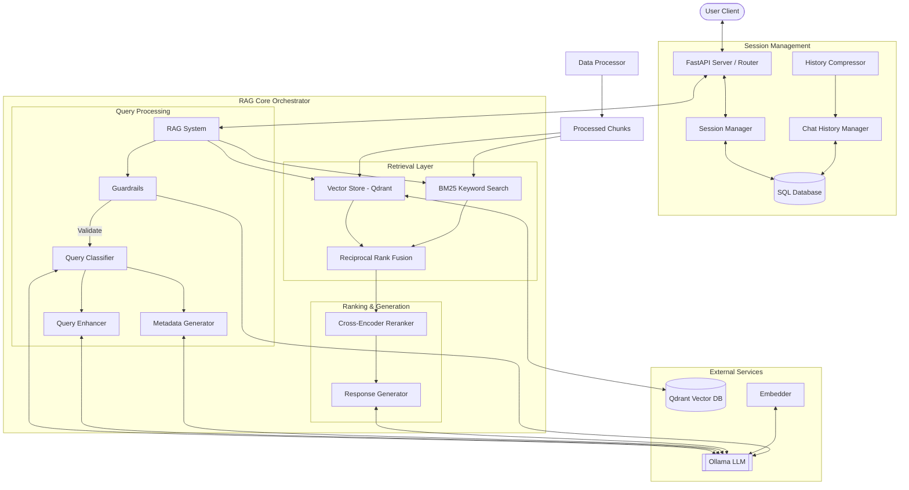
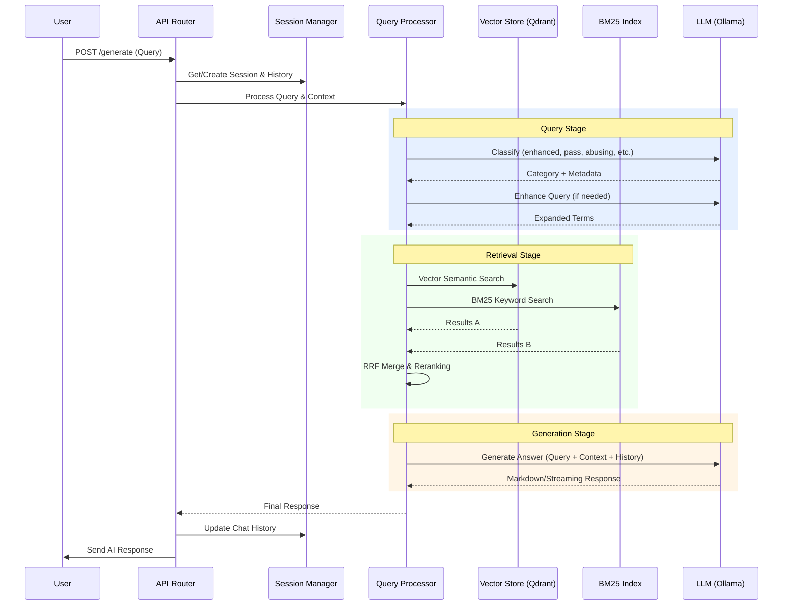

# Computer Engineering RAG System (CE-GPT)


A **multilingual Retrieval-Augmented Generation (RAG)** system built for Computer Engineering courses at King Mongkut's Institute of Technology Ladkrabang (KMITL). It securely and intelligently retrieves course and professor data to answer student inquiries in both Thai and English.

## Key Features

### AI Governance & Security (Guardrails)
- **Input Guardrails**: All user queries are validated before processing to detect prompt injection attempts, profanity, and system exploits.
- **Abusive Query Rejection**: Malicious or harmful prompts are blocked immediately with context-aware warning responses.
- **Query Classification**: Further filters queries into 3 clean profiles (`enhanced`, `pass`, `conversational`) to ensure precise routing.

### Hybrid Search & Reciprocal Rank Fusion (RRF)
- **Vector Search (Qdrant)**: High-dimensional semantic embeddings to find conceptual matches.
- **Keyword Search (BM25)**: Exact keyword matching to ensure specific terms (like course codes) are never missed.
- **Rank Fusion (RRF)**: Intelligently merges Vector and BM25 results, applying a mathematical ranking formula to deliver the absolute most relevant context to the LLM.
- **Cross-Encoder Reranking**: Optional secondary reranking pass for extreme precision.

### Advanced Session & Chat History Management
- **Context-Aware Responses**: Supports persistent, per-user chat sessions using a relational database.
- **Follow-up Detection**: Implicitly detects pronoun references and appending past context into current queries.
- **History Compression**: Summarizes older conversation blocks automatically at configurable intervals, allowing practically infinite chat history while strictly remaining within token limits.

### System Observation & Performance Monitoring
- **Real-Time Metrics**: Endpoints to track system health, operational status, and chunk processing counts.
- **Performance Profiling**: Granular, in-memory tracking of execution times across all pipeline steps (Embedding, Search, Reranking, Enhancement, Generation).
- **Structured CSV Logging**: Comprehensive, automated CSV logs per component for long-term usage analytics and bottleneck identification.

---

## Architecture Overview



---

### Query Execution Workflow



---

## Repository Structure

```text
CE-GPT/
├── src/                    # Core RAG System Engine
│   ├── core/               # Active components
│   │   ├── rag.py          # Orchestration Pipeline
│   │   ├── guardrail.py    # AI Governance and Input Sanitization
│   │   ├── embedder.py     # Embedding Generation
│   │   ├── reranker.py     # Cross-Encoder
│   │   ├── query.py        # Query enhancement & metadata parsing
│   │   ├── generator.py    # Final LLM response generation
│   │   ├── vector_store.py # Qdrant interaction
│   │   ├── session_manager.py # User session lifecycle
│   │   ├── chat_history.py # Chat context fetching/storage
│   │   └── history_compressor.py # Context summary compression logic
│   ├── preprocess/         # Unified data ingestion pipeline
│   │   └── data_processor.py # Handles Course, Professor, and generic data
│   └── utils/              # Observers, DB logic & Error Handling
│       ├── config.py
│       ├── database.py
│       ├── error_handler.py
│       ├── performance_monitor.py
│       └── performance_logger.py
├── server/                 # FastAPI REST application
│   ├── app.py              
│   ├── router.py           # Core endpoints
│   └── models.py           # Pydantic Schemas
├── prompt/                 # LLM Prompt Templates
│   ├── input_guardrail.md  # System prompts for guardrailing
│   ├── system_prompt.md    
│   ├── query_classifier.md 
│   ├── query_enhancer.md   
│   └── metadata_generator.md
├── evaluation/             # Evaluation
│   ├── evaluate.py         # Response Quality eval
│   ├── run_testcase.py     # End-to-end dataset tester
│   └── test_concurrent.py  # Load testing
├── setup/                  # Initialization scripts
│   └── init_database.py    
├── data/                   # Source knowledge files
│   ├── raw/                
│   └── processed/          
├── logs/                   # Emitted usage and performance
├── Dockerfile              # Docker Container
└── docker-compose.yml      # Multi-container orchestration
```

---

## Setup & Installation

### Prerequisites
- Python 3.11+
- [Ollama](https://ollama.com/) (using Gemma or LLaMa models)
- Local or Cloud [Qdrant](https://qdrant.tech/) instance
- PostgreSQL or SQLite (for Session/History tracking)

### Quick Start

1. **Clone & Install**
   ```bash
   git clone <repository-url>
   cd CE-GPT
   pip install uv
   uv pip install -r requirements.txt
   ```

2. **Run Qdrant (via Docker)**
   ```bash
   docker run -p 6333:6333 -p 6334:6334 qdrant/qdrant
   ```

3. **Configure Environment**
   Copy `.env.example` to `.env`. Ensure `DATABASE_URL`, `QDRANT_URL`, and `OLLAMA_URL` are defined.

4. **Pull Necessary AI Models**
   ```bash
   ollama serve
   # In a new terminal:
   ollama pull gemma3:4b-it-qat
   ```

5. **Initialize Database**
   ```bash
   python setup/init_database.py
   ```

6. **Start Application Server**
   ```bash
   uvicorn server.app:app --host 0.0.0.0 --port 8000 --reload
   ```

*(Alternatively, use `docker-compose up --build` for complete containerized setup.)*

---

## API Usage Highlights

The root API interacts heavily with User and Session IDs to maintain deep, compressed history logs.

Interactive docs available at: `http://localhost:8000/docs`

### Core RAG Generation (Sync & Stream)
`POST /api/v1/generate` (Standard)
`POST /api/v1/generate/stream` (SSE Streaming)

```json
{
  "query": "Is artificial intelligence a required course?",
  "user_id": "student-xyz",
  "session_id": "optional-persisted-session-uuid",
  "language": "en",
  "use_reranking": true
}
```

### System Tracking & Observation Profiles
- `GET /api/v1/status` - Current component operational status
- `GET /api/v1/performance` - Fetches metrics logged by the observation system
- `POST /api/v1/performance/export` - Triggers a CSV dump of system metrics

---

## Evaluation & Testing

The `evaluation/` directory holds scripts intended to benchmark the accuracy, toxicity blocking, and scaling efficiency of the framework.

- `python evaluation/run_testcase.py` - Runs sample datasets and compares accuracy.
- `python evaluation/test_concurrent.py` - Inundates the app with requests to test concurrency robustness.
- `python evaluation/evaluate.py` - Runs precision & recall checks on the embedded outputs.
